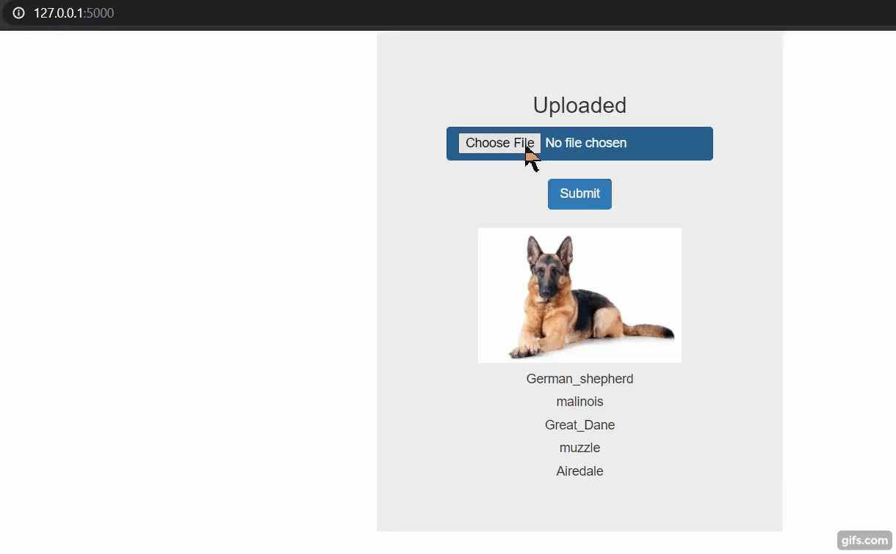

# Dog-Breed-CLassification-Flask-Web-App
A deep learning end to end flask web app to classify dog breeds of the uploaded image using RESNET-50 pretrained weights.  

The project uses Convolutional Neural Networks (CNNs)! A pipeline is built to process real-world, user-supplied images. Given an image of a dog, the algorithm will identify an estimate of the canine’s breed. If supplied an image of a human, the code will identify the resembling dog breed.  
The steps that were followed to work through the project were the following:  
Step 0: Import Datasets  
Step 1: Detect Humans  
Step 2: Detect Dogs  
Step 3: Create a CNN to classify Dog Breeds (from scratch)  
Step 4: Use a CNN to classify Dog Breeds (using Transfer Learning)  
Step 5: Create a CNN to classify Dog Breeds (using Transfer Learning)  
Step 6: Write an algorithm  
Step 7: Test algorithm  
 
ResNet50 is a variant of ResNet model which has 48 Convolution layers along with 1 MaxPool and 1 Average Pool layer. It has 3.8 x 10^9 Floating points operations. It is a widely used ResNet model and we have explored ResNet50 architecture in depth. his architecture can be used on computer vision tasks such as image classififcation, object localisation, object detection.And this framework can also be applied to non computer vision tasks to give them the benifit of depth and to reduce the computational expense also.  

Here's the output:

